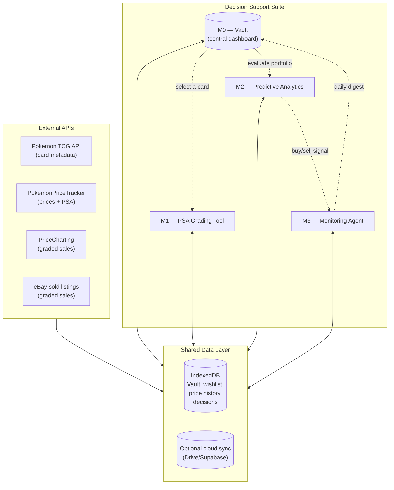

# Pokemon Investment Decision Support Suite — Design

A working design for a four-module suite that turns ad-hoc card decisions into a tracked, evidence-based process. Built around a shared vault so every module sees the same collection and the same prices.

---

## 1. Vision

One tool, four modules, one data spine. Each module is usable alone; together they answer four questions you actually face as a collector-investor:

- **Vault:** What do I own, what's it worth, and what am I chasing?
- **PSA tool:** For a card I just pulled, should I grade, sell raw, or hold?
- **Analytics:** Is this card cheap or expensive right now, and how confidently can I say so?
- **Agent:** Is there anything I should *do* this week without me having to look?

The whole thing runs in a browser today and grows into a small cloud setup only when the agent needs to run while you're asleep.

---

## 2. Architecture at a glance



The data spine is the important part. Cards, prices, decisions, and signals all live in one local IndexedDB store; modules read and write from it instead of talking to each other directly. This is what makes them independently usable and also coherent when combined.

---

## 3. Module 0 — The Vault (central dashboard)

### Purpose

Be the single source of truth for what you own, what you want, and what each thing is worth right now. Replaces Collectr-as-a-spreadsheet with a richer search/UX layer that also feeds the other modules.

### Data model

**Card record** (one per physical copy, not per card design):

| Field | Notes |
|---|---|
| `id` | Local UUID |
| `tcg_id` | Pokemon TCG API id (`base1-4`) — used to query external pricing |
| `name`, `set`, `number`, `language` | Identity |
| `condition` | `raw_nm`, `raw_lp`, `psa_10`, `psa_9`, `cgc_10`, etc. |
| `quantity` | Almost always 1; supports bulk holdings of a single card |
| `cost_basis` | Acquisition price you paid |
| `acquired_on`, `acquired_from` | Date + source (pack pull, eBay, trade, etc.) |
| `image_url`, `image_local` | For thumbnails; local override for promos not in any DB |
| `tags` | Free-form: `vault`, `trade-bait`, `moonshot`, `set-charizard-base` |
| `notes` | Anything you want |
| `last_priced_at`, `last_market_price` | Cached so we don't refetch on every page load |
| `linked_decisions[]` | Foreign keys into the PSA decision log |

**Wishlist record:**

| Field | Notes |
|---|---|
| `card_id` | Same identity scheme as above |
| `target_buy_price` | What you'd pay |
| `max_pay` | Hard upper bound |
| `alert_rule` | "Notify when market < target" |
| `priority` | 1–5 — used to rank when multiple alerts fire |
| `notes` | |

**Price history record** (time series, one per card per fetch):

| Field | Notes |
|---|---|
| `tcg_id`, `condition`, `ts`, `price`, `source` | Append-only |

### Features

- **Import:** Drag/drop a Collectr CSV. We map their columns to ours, normalize card names, attempt a TCG-API match per row, and surface anything that didn't auto-match for manual fix.
- **Manual add:** Same search-bar UX as the PSA tool; one-click "Add to vault" from any search result, with quantity / condition / cost-basis fields.
- **Browse:** Sortable table with filters (set, condition, value bucket, tags, P/L sign). Plus a gallery view with images. Plus a "set completion" view showing what % of each set you own.
- **Pricing refresh:** On dashboard open, fetch market price for any card not refreshed in the last N hours (default 24). Cache in IndexedDB. Manual "refresh all now" button for impatient sessions.
- **P/L dashboard:** Total portfolio value, total cost basis, unrealized P/L (absolute and %), top 5 winners/losers, P/L over time (line chart if we have history).
- **Search:** Same contains-style logic as the PSA tool, but also searches your own collection first. Typing "charizard" returns *your* Charizards before any external API call.
- **Wishlist:** Separate tab. Each entry shows current market vs target, color-coded distance. Click → buy from TCGPlayer / eBay (deep link).

### Integration with other modules

- The PSA tool can be launched from any vault row ("Should I grade this one?") and reads its raw price + identity directly from the vault. Decisions get saved with `card_id` so they show up on the card's history.
- The analytics module reads the vault's `price_history` table.
- The agent watches the vault + wishlist and emits signals into the vault's signal log.

### UX notes

- Single page, three primary tabs: **Collection** (browse), **Wishlist** (chase list), **Activity** (recent decisions, signals, pricing changes).
- Top of every tab: portfolio value, today's P/L change, active signal count.
- Card detail panel slides in from the right when you click a row — shows image, price history mini-chart, recent decisions, "evaluate for PSA" button.

---

## 4. Module 1 — PSA Grading Tool

The tool you already have. Two integration changes:

1. **Vault-aware search.** Search bar checks the vault first, then external APIs. Lets you go from "I just decided to evaluate" to "decision recorded against this exact copy in my vault" without re-typing identity.
2. **Decision log lives in the vault.** No more localStorage-only history table; every saved decision is a record linked to a vault card. Lets the vault show "you decided GRADE on 2026-05-08; PSA receipt pending" inline.

### New companion view: Bulk Submission Planner

A separate tab that takes any subset of your vault (filtered, or hand-picked) and outputs an optimized PSA submission:

- For each card: which PSA tier minimizes expected cost vs. expected return given the time discount.
- The bundle as a whole: total fees, total expected gain, expected payback period.
- Cards the math flags as "don't grade" surface as their own list for raw selling on TCGPlayer.
- Export the submission list as a CSV ready to paste into PSA's online form.

This is where the math gets really visible — a 50-card submission's optimal tier mix is genuinely non-obvious, and the planner pays for the whole suite the first time it saves you from over-tier-ing a stack of $30 cards.

---

## 5. Module 2 — Predictive Analytics & Portfolio Optimization

### Framing — model-agnostic, decision-focused

The goal isn't "predict prices accurately." The goal is "make better buy/sell/hold decisions over time, given the cards I own, the cards I want, my budget, and the market." That's a *decision* problem, and price prediction is a means to it — not the end.

Two consequences:

1. **No religion about specific models.** Linear regression, gradient-boosted trees, time-series models (ARIMA, Prophet), neural nets — they're all candidates. The right choice is whatever gives the best decisions against held-out data. We benchmark, we keep what wins.

2. **Predict and optimize as one loop, not two.** The classical pipeline ("model predicts price → optimizer picks actions") trains the model on price-error and the optimizer on returns — two misaligned objectives. The integrated approach (sometimes called "decision-focused" or "predict-then-optimize" learning) trains the whole system on the objective that actually matters: realized portfolio P/L over time. We can start with the classical decoupled pipeline (much easier to debug) and migrate toward integration as we collect feedback.

### What we know up front about this market

Pokemon card prices are driven by sentiment, scarcity events, content creators, set rotation, and pop-report changes. A model trained only on historical prices will fit the past well and predict the future poorly. Useful models need features beyond price history:

- Set release date and age (set-rotation effect)
- PSA pop-report momentum (how fast graded copies are entering circulation)
- A broader market index (Pokemon TCG sentiment)
- Sale velocity (how fast each card is moving)
- Event tags you log (reprint announcements, content creator pumps)
- Time-of-year effects

### Phase A — Heuristics (ship first, always)

Even after we have models, heuristics serve as the floor we have to beat. For each card:

- **30/90/365-day price range** with current price as a percentile rank.
- **Volatility:** std-dev / mean over the window. >25% gets flagged as "noisy."
- **Trend slope:** simple regression over last 90 days.
- **Index-relative move:** vs a broader Pokemon basket or your own portfolio.
- **Pop-report delta:** if available.

Output: per-card **Buy zone / Sell zone / No signal**, with reasoning the user can verify.

### Phase B — Models

Models predict (price, prediction interval) for some horizon (e.g., 30 / 90 / 180 days). We benchmark candidates against a held-out time-split test set; pick what wins on calibration + accuracy + decision quality. We keep heuristics as the baseline — if a model can't beat heuristics on *decisions*, the model doesn't ship.

Possible candidates (we're not committing to any):
- Per-card ARIMA / Prophet baselines
- Gradient-boosted regression with the feature set above
- Hierarchical models that share strength across cards in a set
- Neural sequence models if/when we have enough data

### Phase C — Integrated learning + optimization

Once predictions are in place, layer a portfolio optimizer on top:

- **Inputs:** current vault, wishlist, budget, time horizon, risk tolerance, tax cost basis, liquidity per card.
- **Output:** ranked action set — "sell these N, buy these M, hold the rest" — chosen to maximize a risk-adjusted return objective subject to constraints.
- **Feedback loop:** every executed action becomes a labeled outcome. Over months, we can train the *combined* predict-and-optimize system end-to-end on realized P/L, not on price-prediction MSE. This is where the "decision-focused" framing pays off.

### What the analytics module outputs

Per card:
- Phase A signals (always)
- Phase B forecast (when we have a model that beats the heuristics)

Per portfolio:
- Most bullish / most bearish vault cards
- Wishlist entries near attractive entry points
- (Phase C) Suggested action list with expected return and risk numbers

### Honest scope check

Phase A and Phase B (decoupled) are realistic personal-project work. Phase C (true integrated learning) is research-grade engineering; we should ship A and B and *use them for months* before deciding whether C is worth the effort. The user's collection growth will also dictate when we have enough data to support C honestly.

### Phase A — Heuristics (ship first)

For each card in the vault and wishlist, compute and display:

- **30/90/365-day price range** with a marker at the current price (visual percentile rank).
- **Volatility:** standard deviation of daily price as % of mean. Cards >25% volatile flag as "noisy — don't read too much into a single sale."
- **Trend slope:** simple linear regression over last 90 days. Output one of `up`, `flat`, `down` plus the rate ($/week).
- **Index-relative move:** how is this card doing vs. a broader Pokemon index (e.g., your own portfolio, or a tracked basket of "blue-chip" cards). Cards that diverge from the index are the interesting ones.
- **Pop-report delta:** if available, change in PSA population over the last 30 days. Big pops grow = price headwind.

Output per card: **Buy zone** (current price is in the bottom Nth percentile of its recent range AND trend isn't sharply down) or **Sell zone** (top percentile AND trend isn't sharply up). Plus a "no clear signal" state, which is honest.

### Phase B — Models (only after the heuristics earn their keep)

If we want to predict, the *right* model is one that uses features beyond price history:

- Days since set release (proxy for set-rotation effect)
- Pop-report momentum (rate of new PSA 10s entering circulation)
- A broader market index (Pokemon TCG sentiment)
- Recent sale velocity (how fast each card is moving)
- Time-of-year effects (holiday season)

A regression model with these inputs predicts 30/60/90-day price with calibrated uncertainty intervals. The output isn't "the price will be $X" — it's "the price will be $X ± $Y with 80% confidence; based on this, the current $Z is in the cheap/expensive/fair zone."

This requires real engineering effort (data pipeline, training, evaluation, drift monitoring). I'd hold this until phase A is in use and you have a sense of which signals you actually find decision-useful.

### What the analytics module outputs

Per card:
- Phase A signals (buy zone / sell zone / no signal)
- Volatility class, trend, recent percentile rank
- (Phase B) Forecasted price band

Per portfolio:
- "Which of your cards is the analytics module most bullish on right now?"
- "Which is most bearish?"
- "Which wishlist items are at a historically attractive entry?"

---

## 6. Module 3 — Monitoring Agent

The agent's job is to do the thinking on a schedule, not just when you log in. Three architectural options:

### Option A — Browser-only ("checks on page load")

Every time you open the dashboard, the agent runs: refresh prices, evaluate signals, log new alerts. No infrastructure.

- ✓ Free, simple, fits the rest of the suite.
- ✗ Only runs when you open it — so a price spike at 2 AM is noticed at 7 AM when you open the dashboard, not when it happens.

### Option B — Cloud cron (recommended Phase 2)

A small scheduled task runs every N hours from somewhere stable (GitHub Actions cron, Cloudflare Workers, or a $5/month VPS). It pulls prices, evaluates rules, and either pushes to your vault's signal log (sync via Supabase or similar) or sends you a daily email digest.

- ✓ Runs while you sleep, can alert in near-real-time, can send emails.
- ✗ Some setup; needs a cloud destination for the signal log (or just an email recipient).
- Cost: $0–5/month plus possibly a $10/month PokemonPriceTracker API plan if your card count grows.

### Option C — Local app + system scheduler

Run a small Python/Node script via your OS scheduler (Windows Task Scheduler, macOS launchd, cron on Linux). Writes results to a JSON file your dashboard reads.

- ✓ More private, free.
- ✗ Only runs when your computer is on.

**Recommendation:** ship Option A in Phase 1 (zero-effort, useful immediately). Move to Option B in Phase 5 once you actually feel the missing "alert while I sleep" gap.

### What signals the agent generates

- Wishlist hit: a chased card's market price crossed your target.
- Vault spike: an owned card's market moved >X% in N days (configurable per tier — bulk cards get noisier thresholds than chase cards).
- Vault decay: an owned card moved down >X% — possibly time to rebalance.
- New PSA pop: PSA 10 population grew >Y% — headwind for your graded copies.
- Sentiment events: a tracked set just had its rotation, a hyped reprint announcement, etc. (manual entries by you, the agent just timestamps them).

### Agent output formats

- **In-dashboard:** a "Today's signals" panel on the vault home screen.
- **Daily/weekly digest:** rendered as HTML, optionally emailed. Single page summary: portfolio value, biggest movers, hit alerts, action recommendations.
- **One-tap action:** every signal has a "do something" button — "Sell this on TCGPlayer," "Buy from cheapest TCGPlayer listing," "Snooze this alert for 7 days."

---

## 7. Cross-cutting concerns

These are the unglamorous decisions that determine whether the suite is robust or a pile of clever modules that don't quite cohere.

### Card identity

Every card has one local ID. A resolver table maps it to external IDs:

```
local_id ──▶ {
    tcg_id:   "base1-4",
    tcgplayer_product_id: 490294,
    ppt_id:   "base1-4",            (often same)
    pricecharting_url: "...",
    user_label: "Mega Charizard X ex #023 (promo)"   (for manually-entered cards)
}
```

This way, a new pricing source can be added without touching anything else.

### Data storage

**Recommended:** IndexedDB. Browser-only, persistent, holds GBs, works offline. Built-in to every modern browser.

Vault as a JSON-style object store; price history as an indexed time-series; decisions and signals as append-only logs.

**Cloud sync (planned Phase 2, via Google Drive):** the vault data lives as a single JSON file in a designated folder of your own Google Drive. The tool reads/writes that file via the Drive REST API after a one-time OAuth grant. Bonus: Drive keeps version history automatically, so you have free undo for accidental overwrites. The data stays in your Drive — no third-party server in the loop. We skip Supabase / Firebase entirely; less account sprawl, you fully own the data, and it costs nothing.

**What's wrong with localStorage:** the 5–10 MB limit fills up fast once you have a few hundred cards with price history. Localstorage is fine for settings; IndexedDB is fine for everything else.

### Pricing freshness

- Default refresh: 24 hours.
- User can force "refresh all now" but it costs API credits, so the UI shows the count.
- Price history: append a new record every refresh, even if the price hasn't moved. Storage is cheap; missing data is expensive.

### Settings

One settings panel, shared across modules. Currently scattered (the PSA tool has its own); consolidate into a single store.

### Authentication

For external API keys (PokemonPriceTracker, PriceCharting, etc.): single Settings tab, keys stored in IndexedDB (not exported to backup files by default; "include keys" is a checkbox on export).

---

## 8. Tech stack recommendation

For where we are now and where we want to go:

- **Frontend:** single-page app, vanilla JS or a minimal framework (Preact, Lit). Tabs for vault/PSA/analytics/agent. Same aesthetic as the current PSA tool.
- **Storage:** IndexedDB via a small wrapper (Dexie.js is the standard).
- **Charts:** Chart.js (already in use).
- **CSV import/export:** Papa Parse for parsing, vanilla blob URLs for export.
- **Backend (optional, Phase 5+):** small Python service for ML training and the portfolio optimizer, deployed to Railway/Render/Fly free tier. Reads/writes the vault JSON via Google Drive API.
- **Agent (optional, Phase 5+):** GitHub Actions cron OR Cloudflare Worker scheduled tasks; writes signal log back to the Drive JSON.

The frontend is one static HTML file you double-click to open. No build pipeline, no hosting, no accounts — same as the PSA tool, just bigger. Cloud bits get added incrementally only when their absence becomes the bottleneck.

---

## 9. Phased roadmap

A realistic order of building, with checkpoints where you decide whether to keep going.

**Phase 1 — Vault MVP (1 file, browser-only).** Import Collectr CSV, browse + search, manual add/edit, single-card detail view, total portfolio value + P/L. Live pricing via existing APIs, cached. *Checkpoint: are you actually using this daily?*

**Phase 2 — PSA tool integration.** Move the PSA tool into the vault as a tab; bind decisions to vault card IDs; build the bulk submission planner. *Checkpoint: did the planner change a real submission decision?*

**Phase 3 — Wishlist + alerts.** Wishlist tab with target prices; on-page-load agent that flags "wishlist hit" and "vault moved >X%." *Checkpoint: did an alert lead to a transaction?*

**Phase 4 — Analytics heuristics.** Phase A signals (percentile rank, volatility, trend, buy/sell zones). *Checkpoint: do the signals actually update your priors, or are you ignoring them?*

**Phase 5 — Cloud agent + daily digest.** Move the agent into a cron-driven cloud task; daily email digest; ability to act on signals from the email. *Checkpoint: are the digests changing what you do this week?*

**Phase 6 — Predictive models (decoupled).** Train candidate models (gradient-boosted, time-series baselines, etc.) on the data accumulated through Phase 4. Benchmark each against the heuristics on a held-out time split; only ship models that beat heuristics on *decision quality*, not just price-prediction error.

**Phase 7 — Integrated predict-and-optimize.** Add the portfolio optimizer on top of the predictive layer, then close the loop: train the combined system on realized P/L over time. This is research-grade work and only justified once Phase 6 has shown clear lift and the user has months of execution history to train against.

**Phase 8 — Google Drive cloud sync.** Once the suite is in regular daily use, add OAuth-based sync of the vault JSON to your Drive. Enables phone access, multi-laptop use, and gives the cloud agent in Phase 5 a stable read/write target.

Most of the value lands in Phases 1–4. Phase 5 (cloud agent) and Phase 8 (Drive sync) are quality-of-life upgrades. Phases 6–7 are where the suite earns its more ambitious name — they're optional and gated on whether the earlier phases produced a habit worth deepening.

---

## 10. Beyond your spec — worth considering

A few additions I'd push to include because they're cheap to build and high-value once they exist:

- **Cost basis & tax tracking.** Each sale generates a P/L entry tagged with holding period (long vs short) and acquisition source. At year end, export a CSV your accountant can use.
- **Trade matcher.** Given two cards in your vault and a relative price snapshot, flag when a swap would create realized value (e.g., "Trade Card A for two of Card B at today's prices = +$X").
- **Liquidity score.** How many copies of this card have sold in the last 30 days at major venues? A "high EV but illiquid" card needs different sizing than a high-volume one.
- **Pull-rate tracker.** For new sets, log every pack you open and what you pulled. Compare to published pull rates. Useful for both budget tracking and detecting "your pulls have been unusually bad" calibration.
- **Counterfactual playback.** "If you'd sold all PSA 10s on 2026-01-01, you'd have X. If you sold today, you'd have Y. Best historical day to have sold: Z." Calibrates your selling instincts vs. holding.
- **Authentication risk flags.** For high-value cards, surface population trend + warning flags (recent counterfeit reports for the set, etc.).
- **Set-completion view.** Visualizes percent complete for sets you collect, with current-market cost-to-complete.

The counterfactual playback is the single most underappreciated feature on this list. Most collectors *think* they're good at timing sales; the data usually shows otherwise. Confronting that pattern privately, in your own data, is more behavior-changing than any external signal.

---

## 11. Honest caveats

- **ML on Pokemon prices is hard, and most attempts overpromise.** Heuristics will get you 70%+ of the achievable value at 5% of the engineering cost. Don't skip them to build models. The integrated predict-and-optimize approach is the *right* north star but is much harder than it sounds — earn the right to attempt it by shipping the simpler stuff first.
- **Free pricing APIs have real limits.** PokemonPriceTracker free tier (100 credits/day) handles a vault of ~50 cards refreshed once daily. A 500-card vault needs the $10/month tier, or the $99/year tier if it sticks. You've signaled willingness to pay when data needs justify it — that's the right policy. We'll surface the credit-cost-per-load in the UI so the upgrade decision is informed.
- **The agent is a maintenance commitment.** "Wake up and email me" needs a cron job somewhere; that's a small thing but it's not zero. If you don't want it, the page-load version is genuinely fine — most signals can wait a few hours.
- **Browser-only storage is single-device.** Until cloud sync is added, your vault on your laptop is invisible to your phone. JSON export/import covers the gap but it's manual.
- **Prices are noisy.** A single anomalous eBay sale can move a "market price" you'd never actually transact at. The analytics module needs to dampen single-sale outliers (median over recent N, not mean) or you'll chase ghosts.

---

## 12. Recommended next step

Build Phase 1 (Vault MVP) as a standalone static HTML file in the same folder as the PSA tool. Don't try to integrate them yet — first prove that the vault by itself is something you actually open every day. Once that's confirmed, Phase 2 wires the PSA tool in as a tab and the bulk submission planner becomes possible.

Concretely, the smallest useful next file is:

- `vault.html` — Collectr CSV import + browse/search/edit + portfolio value + per-card price refresh.
- Stores in IndexedDB via a small Dexie wrapper.
- Reuses the PSA tool's settings store and external API code.

Two to three sessions of focused work; immediately useful as soon as the CSV import works.
