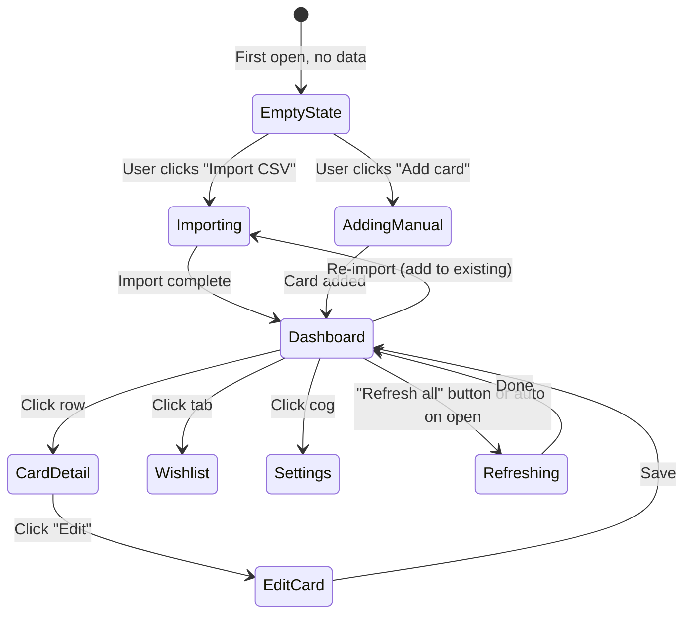

# Vault MVP — Data Schema & UX Design

The first concrete module of the suite. A single static HTML file (`vault.html`) that imports your Collectr CSV, lets you browse and edit your collection with live pricing, tracks a wishlist, and shows portfolio P/L. Browser-only, IndexedDB-backed, no accounts.

---

## 1. Scope of the MVP

### In scope

- Import Collectr CSV with column auto-mapping + manual fixup
- Manual add / edit / delete cards
- Browse: sortable, filterable table with thumbnails
- Card detail panel with pricing + history mini-chart
- Wishlist (separate tab) with target prices and "distance to target" display
- Portfolio header: total value, cost basis, unrealized P/L
- Pricing refresh per card, cached for N hours
- Settings: API key, refresh interval, currency
- JSON export/import of the entire vault (your backup)

### Deliberately deferred

- Charts beyond per-card mini-history (portfolio over time, set completion, etc.)
- Alerts / signals / "buy zone" badges → Phase 3+
- PSA tool integration (decisions linked to vault cards) → Phase 2
- Cloud sync via Google Drive → Phase 8
- Gallery view, set completion view → polish phase
- Bulk PSA planner → Phase 2

The point of MVP is *use it daily for two weeks*. Anything that doesn't directly serve that test is out.

---

## 2. Data Schema (IndexedDB via Dexie)

Database name: `pokemonVault`, version 1. Five object stores.

### 2.1 `cards`

Primary collection store. One record per physical copy you own (a PSA 10 and a raw NM of the same card are separate records).

```typescript
{
  id: string,                    // local UUID, e.g. "card_01HXY..."
  // Card identity
  category: CategoryEnum,        // 'Pokemon' | 'Digimon' | 'One Piece' | ... see below
  name: string,                  // "Charizard ex" / "Aegiomon (Alternate Art)"
  set: string,                   // "Obsidian Flames" / "Time Stranger"
  number: string,                // "125/197" / "BT24-034 SR" — as printed
  rarity: string,                // "Ultra Rare" / "SR" / "Illustration Rare"
  variant: VariantEnum,          // 'normal' | 'holofoil' | 'reverse_holofoil' | '1st_edition' | 'foil' | 'other'
  language: 'english' | 'japanese' | 'korean' | 'chinese' | 'other',
  // External IDs (Pokemon only for now; null for other TCGs)
  tcg_id: string | null,         // "sv3-125" — Pokemon TCG API canonical id
  tcgplayer_product_id: string | null,
  // Condition / grade
  condition: ConditionEnum,      // simplified enum, see below
  grade_label: string | null,    // raw original grade string from import, preserved for round-tripping
                                 // e.g. "PSA 10.0 GEM - MT" / "CGC 9.5 Mint+" — null if Ungraded
  quantity: number,              // default 1
  // Acquisition
  cost_basis: number | null,     // per copy, in USD; null = untracked (Collectr's 0 imports as null)
  acquired_on: string | null,    // ISO date (mapped from Collectr's "Date Added" on import)
  acquired_from: string | null,  // 'pack-pull' | 'ebay' | 'tcgplayer' | 'trade' | 'store' | 'gift' | 'other' | freeform
  // Display
  image_url: string | null,      // remote (Pokemon TCG API)
  image_local: string | null,    // data: URL (user-uploaded fallback for promos / non-Pokemon)
  // Organization
  tags: string[],                // freeform; import auto-adds Portfolio Name + Category
  notes: string,
  // Pricing cache (denormalized for fast table render)
  last_priced_at: string | null,
  last_market_price: number | null,
  last_price_source: 'pokemontcg' | 'ppt' | 'pricecharting' | 'collectr_import' | 'manual' | null,
  // Bookkeeping
  created_at: string,
  updated_at: string
}

CategoryEnum =
  | 'Pokemon' | 'Digimon' | 'Dragon Ball' | 'Gundam'
  | 'One Piece' | 'Union Arena' | 'YuGiOh' | 'Magic' | 'Lorcana' | 'other'
  // Free-form allowed; the enum is just a hint for the UI.

VariantEnum =
  | 'normal'              // base / non-foil
  | 'holofoil'            // standard holo
  | 'reverse_holofoil'    // reverse holo
  | '1st_edition'         // 1st edition (often also holofoil)
  | 'foil'                // generic non-Pokemon "Foil"
  | 'other'

// Condition enum — simplified for v1 per user preference.
// Half-grades (e.g., CGC 9.5, BGS 9.5) fold into the next-lower whole grade,
// but the original grade string is preserved in `grade_label` so nothing is lost
// and a future expansion can fan out half-grades without re-importing.
ConditionEnum =
  | 'raw_nm' | 'raw_lp' | 'raw_mp' | 'raw_hp' | 'raw_dmg'
  | 'psa_10' | 'psa_9' | 'psa_8' | 'psa_7' | 'psa_lower'
  | 'cgc_10' | 'cgc_9' | 'cgc_lower'
  | 'bgs_10' | 'bgs_9' | 'bgs_lower'
  | 'sgc_10' | 'sgc_9' | 'sgc_lower'
  | 'other'
```

**Indexes:**

- `by_category` — primary filter (Pokemon vs everything else)
- `by_tcg_id` — fast lookup for pricing refresh + dedupe checks
- `by_name` — search prefix
- `by_set` — filter by set
- `by_condition` — filter
- `tags` *(multi-entry)* — filter by any tag
- `by_updated_at` — recent-activity sort
- `by_value` (computed via `quantity * last_market_price`) — sort by holding size

### Multi-TCG behavior

The schema is TCG-agnostic. **Pokemon cards get first-class treatment** — auto-priced via the Pokemon TCG API and PokemonPriceTracker, eligible for the PSA tool and predictive analytics. **Cards from other TCGs are tracked** — stored with full identity, snapshot-priced from the CSV import's "Market Price" column, and re-priced whenever you re-import a fresh Collectr export. The vault's main table filters by category so you can view "Pokemon only" or "all" with one toggle. Down the road, when/if we want auto-pricing for Digimon or One Piece, we add the relevant adapter — the data model already supports it.

### 2.2 `wishlist`

```typescript
{
  id: string,                    // "wish_01H..."
  // Target card identity (may or may not exist in vault)
  name: string,
  set: string | null,
  number: string | null,
  condition: ConditionEnum,
  tcg_id: string | null,
  image_url: string | null,
  // Targeting
  target_buy_price: number,      // what you'd pay
  max_pay: number | null,        // hard upper bound
  alert_rule: 'below_target' | 'below_max' | 'always_on_change',
  priority: 1 | 2 | 3 | 4 | 5,   // for ranking when many alerts fire
  notes: string,
  // Pricing cache
  current_market: number | null,
  last_priced_at: string | null,
  last_alerted_at: string | null,
  created_at: string,
  updated_at: string
}
```

**Indexes:** `by_tcg_id`, `by_priority`, `by_target_buy_price`

### 2.3 `prices`

Append-only time series. Every refresh writes one row per card per source.

```typescript
{
  id: number,                    // autoincrement
  tcg_id: string,                // foreign key (or local card id for manual entries)
  condition: ConditionEnum,
  ts: string,                    // ISO datetime
  price: number,
  source: 'pokemontcg' | 'ppt' | 'pricecharting' | 'manual'
}
```

**Indexes:** compound `[tcg_id+condition+ts]` — fast time-range queries per card.

This grows over time but stays small (≈1 KB per row × ~30 cards/day × 365 = ~11 MB/year). Pruning policy (later): keep daily samples for >1 year, hourly for last 30 days.

### 2.4 `settings`

Single record (keyed by string `'singleton'`), all settings centralized. Will eventually merge with PSA-tool settings.

```typescript
{
  key: 'singleton',
  // API keys
  ppt_api_key: string,
  // Refresh policy
  refresh_interval_hours: number, // default 24
  auto_refresh_on_open: boolean,  // default true
  // Display
  currency: 'USD',                // future: EUR, JPY
  default_view: 'table' | 'gallery',
  visible_columns: string[],
  // Pricing source priority
  raw_price_source: 'tcgplayer' | 'ppt',
  graded_price_source: 'ppt' | 'pricecharting' | 'manual',
  // PSA tool defaults (carried over)
  psa_fee: number, psa_ship_out: number, // etc.
  // Updated by user
  updated_at: string
}
```

### 2.5 `import_audits`

Each Collectr CSV import generates a record so the user can review what happened later.

```typescript
{
  id: number,                    // autoincrement
  filename: string,
  imported_at: string,
  rows_total: number,
  rows_matched: number,          // resolved against Pokemon TCG API
  rows_unmatched: number,
  unmatched_rows: object[]       // the raw CSV rows that didn't auto-match
}
```

### Relationships at a glance

```
settings (singleton)
cards.tcg_id ──┐
               ├──> prices.tcg_id (1:N time series)
wishlist.tcg_id ┘
import_audits (standalone log)
```

No foreign-key constraints — IndexedDB doesn't enforce them. Application-level joins.

---

## 3. Lifecycle / state diagram



---

## 4. Screen-by-screen UX

I'll use ASCII wireframes to keep this fast to iterate on. Each screen gets: layout sketch, key interactions, edge cases.

### Screen 1 — Empty state (first run)

When IndexedDB is empty:

```
┌──────────────────────────────────────────────────────────────────┐
│  Vault                                              ⚙ Settings   │
├──────────────────────────────────────────────────────────────────┤
│                                                                  │
│                                                                  │
│                  Your vault is empty.                            │
│                                                                  │
│      Start by importing your Collectr export, or add a           │
│              card by hand to test the workflow.                  │
│                                                                  │
│             ┌────────────────────┐  ┌────────────────────┐       │
│             │  📥 Import CSV     │  │  ➕ Add a card     │       │
│             └────────────────────┘  └────────────────────┘       │
│                                                                  │
│                                                                  │
│         Need help? See HOW_TO_USE.md in this folder.             │
│                                                                  │
└──────────────────────────────────────────────────────────────────┘
```

**Interactions**
- "Import CSV" → opens the import wizard (Screen 5).
- "Add a card" → opens the add/edit modal (Screen 4).
- Settings cog → opens Settings panel (Screen 7) where the user can paste their PPT key before doing anything else.

**Edge cases**
- If user dismisses both options, they get the dashboard with an inline "empty" message and the two buttons in the top bar.
- If user opens this tool on a different browser than where data lives, IndexedDB is empty here — they'll see this screen. Settings → Import JSON backup is the recovery path.

---

### Screen 2 — Main dashboard

```
┌────────────────────────────────────────────────────────────────────────────────┐
│  Vault   [Collection]  Wishlist                       🔍 ➕ ↻ ⚙               │
├────────────────────────────────────────────────────────────────────────────────┤
│  TOTAL VALUE        COST BASIS         UNREALIZED P/L      LAST REFRESHED      │
│  $4,238.17          $2,950.00          +$1,288.17 (+43.7%) 2h ago              │
├────────────────────────────────────────────────────────────────────────────────┤
│  Filter:  Set ▾  Condition ▾  Tag ▾  Value: any ▾   Sort: P/L $ ▾  ⊞ ☰        │
├────────────────────────────────────────────────────────────────────────────────┤
│ [img] Name                Set            #     Cond   Qty Cost    Market   P/L│
├────────────────────────────────────────────────────────────────────────────────┤
│ [🖼] Charizard ex         Obsidian Flames 125  PSA10  1   $40.00  $220.00  +$180│
│ [🖼] Pikachu VMAX         Vivid Voltage   188  raw NM 1   $35.00  $52.20   +$17│
│ [🖼] Umbreon ex           Prismatic Evol. 161  raw NM 2   $80.00  $61.50   -$37│
│ [🖼] Iono                 Paldea Evolved 269  raw NM 1   $18.00  $44.80   +$27│
│ ... (scroll)                                                                   │
├────────────────────────────────────────────────────────────────────────────────┤
│  Showing 47 of 47 cards.   ⬇ Export CSV   📤 Export JSON                       │
└────────────────────────────────────────────────────────────────────────────────┘
```

**Top bar**

- Logo / title left, primary tabs (Collection, Wishlist), then on the right: search, add card (`➕`), refresh all (`↻`), settings (`⚙`).
- Search is global — finds cards in collection AND wishlist. Typing "char" filters the visible table to all matches.

**Portfolio header** (the strip with four numbers)

- Total value: `Σ (quantity × last_market_price)` over all cards with a price.
- Cost basis: `Σ (quantity × cost_basis)` over cards with a cost_basis.
- Unrealized P/L: total value − total cost basis, with absolute and percent.
- Last refreshed: oldest `last_priced_at` across all cards. Color-coded if stale (>refresh_interval × 2).
- Click any of these numbers → opens a small details popover (which cards contribute most, etc.).

**Filter bar**

- Set: dropdown, multi-select, populated from distinct sets in collection.
- Condition: same.
- Tag: same.
- Value range: slider with two thumbs.
- Sort: by name / set / value / P/L $ / P/L % / acquired date / updated.
- `⊞` Gallery view toggle / `☰` Table view toggle.

**Table**

Columns (sortable by clicking header):

| Col | What | Notes |
|---|---|---|
| Image | 36px thumbnail | Clicking opens detail panel |
| Name | Card name | Bold |
| Set | Set name | Muted text |
| # | Card number | |
| Condition | Badge | Color-coded (raw=gray, PSA10=green, PSA9=blue, etc.) |
| Qty | Quantity | Hidden if 1 |
| Cost basis | $ per copy | Italic if missing |
| Market | $ current market | Stale badge if old |
| P/L | $ and % | Green/red |
| Tags | Tag chips | Truncated if many |
| ... | Row actions menu | Edit / Refresh / Delete |

**Gallery view (toggle)**

A grid of cards (3-6 per row depending on width). Each tile: image, name on hover, value badge, P/L badge. Click to open detail.

**Bottom bar**

- "Showing X of Y" — when filters narrow the view.
- Export CSV (current filter) / Export JSON (full backup with settings).

**Interactions / edge cases**

- Row click → detail panel (Screen 3) slides in from right; table compresses to make room.
- ⌘F / Ctrl+F → focuses search.
- ↻ Refresh all → spawns batch fetch with a progress toast. Disabled if last refresh was <5 min ago (rate limit guard).
- Empty table after filters → "No cards match. [Clear filters]"
- Stale prices (>refresh_interval × 2 old) → market column shows price + small "🕒 stale" indicator.

---

### Screen 3 — Card detail panel (slide-in)

Slides in from the right, ~520px wide. Table on the left compresses; main content remains usable.

```
┌──────────────────────────────────────────┐
│  Charizard ex                          ✕ │
│  Obsidian Flames · 125/197 · 2023-08-11  │
├──────────────────────────────────────────┤
│                                          │
│              [   card image   ]          │
│              [   (clickable)  ]          │
│                                          │
├──────────────────────────────────────────┤
│  Condition  PSA 10         Qty  1        │
│  Acquired   2024-09-12  ·  pack pull     │
│  Cost basis $40.00                       │
│  Market     $220.00      (refreshed 2h ago) │
│  Unrealized +$180.00 (+450%)             │
├──────────────────────────────────────────┤
│  Price history (90d)                     │
│  [───── mini line chart ─────]           │
│  30d:  low $180 · high $245              │
│  90d:  low $155 · high $260              │
├──────────────────────────────────────────┤
│  Tags:  [PSA Vault] [Charizard chase]    │
│  Notes:  Centered well, sharp corners.   │
│          From OBF blister.               │
├──────────────────────────────────────────┤
│  Look up elsewhere:                      │
│  [TCGPlayer] [PriceCharting] [PSA Anlys] │
├──────────────────────────────────────────┤
│  Linked decisions:                       │
│  • 2026-05-04 — GRADE (your p10: 40%)    │
│    [view in PSA tool]                    │
├──────────────────────────────────────────┤
│  ↻ Refresh price   ✏ Edit   🗑 Delete    │
└──────────────────────────────────────────┘
```

**Interactions**

- Image click → full-size lightbox.
- Tag chip click → filter the table by that tag.
- "Refresh price" → triggers price fetch for this single card; updates panel + table row + price history; ~1-2 sec.
- "Edit" → opens add/edit modal (Screen 4) prefilled.
- "Delete" → confirmation dialog (since it's destructive and undo doesn't exist in MVP).
- "View in PSA tool" → opens psa_decision_tool.html in a new tab, with query params identifying the card so it pre-fills.
- ✕ or pressing Esc → closes panel.

**Edge cases**

- If `image_url` 404s → fallback to gray placeholder with name.
- If `cost_basis` is null → show "—" and "Set cost basis" mini-link that opens the edit modal.
- If price history < 2 points → mini-chart shows "Need more history" message.
- If a card is in the wishlist (rare — owned cards typically aren't), show a "★ also in wishlist" badge.

---

### Screen 4 — Add / Edit card modal

Modal, ~640px wide.

```
┌────────────────────────────────────────────────────────┐
│  Add card                                          ✕   │
├────────────────────────────────────────────────────────┤
│  ◉ Search a card        ○ Enter manually               │
├────────────────────────────────────────────────────────┤
│  [ charizard ex                    ] [#125] [ Search ] │
├────────────────────────────────────────────────────────┤
│  Results:                                              │
│  ┌────┐ ┌────┐ ┌────┐ ┌────┐                           │
│  │img │ │img │ │img │ │img │                           │
│  │name│ │name│ │name│ │name│                           │
│  │set │ │set │ │set │ │set │                           │
│  └────┘ └────┘ └────┘ └────┘                           │
├────────────────────────────────────────────────────────┤
│  Selected: Charizard ex · Obsidian Flames · 125/197    │
├────────────────────────────────────────────────────────┤
│  Condition    [ PSA 10           ▾ ]                   │
│  Quantity     [ 1     ]                                │
│  Cost basis   $[ 40.00     ]                           │
│  Acquired on  [ 2024-09-12  📅 ]                       │
│  Acquired fr. [ Pack pull         ▾ ]                  │
│  Tags         [ PSA Vault ×] [+ add]                   │
│  Notes        [                                    ]   │
│               [                                    ]   │
├────────────────────────────────────────────────────────┤
│                          [ Cancel ]  [ Save card ]     │
└────────────────────────────────────────────────────────┘
```

**Two modes** (radio switch at top)

- **Search a card** (default): reuses the PSA tool's search machinery. After selecting a result tile, the bottom form unlocks with all identity fields pre-filled.
- **Enter manually**: hides the search panel, shows raw inputs for name/set/number/image-upload. For promos not in any database.

**Form fields**

- All optional except: name (or selected search result), condition, quantity.
- Condition dropdown grouped: Raw, PSA, CGC, BGS, SGC, Other. Most-common ones (raw NM, PSA 10, PSA 9) hoisted to top.
- Tags: chip input with autocomplete from existing tags.
- Cost basis: blank means "untracked" (won't contribute to portfolio P/L).

**Edit mode** uses the same modal pre-filled. Title becomes "Edit card." "Save card" button is enabled only if something changed.

**Edge cases**

- Save validates: must have at least name + condition + quantity ≥ 1.
- Duplicate detection: if you try to save a card with the same (tcg_id, condition) as an existing record, prompt: "You already have this card — increase quantity, add as separate copy, or cancel."
- For manual cards with uploaded image: image saved as `image_local` data URL, capped at 200KB after resize.

---

### Screen 5 — Import CSV wizard

Five steps. Modal blocks the rest of the UI until done.

#### Step 1: Upload

```
┌──────────────────────────────────────────────────────┐
│  Import from Collectr (1 of 5)                   ✕   │
├──────────────────────────────────────────────────────┤
│                                                      │
│       ┌────────────────────────────────────┐         │
│       │                                    │         │
│       │      Drop your CSV here            │         │
│       │      or click to choose            │         │
│       │                                    │         │
│       └────────────────────────────────────┘         │
│                                                      │
│  Expected: a Collectr CSV with 16 columns starting   │
│  with "Portfolio Name, Category, Set, ..." — i.e.,   │
│  the file you get from Collectr → Export → CSV.      │
│                                                      │
├──────────────────────────────────────────────────────┤
│                                       [ Cancel ]     │
└──────────────────────────────────────────────────────┘
```

#### Step 2: Filter & options

New step. The Collectr CSV is multi-TCG; this is where the user scopes the import and chooses how duplicates are handled.

```
┌──────────────────────────────────────────────────────┐
│  Import from Collectr (2 of 5) — Filter & options ✕  │
├──────────────────────────────────────────────────────┤
│  Detected: 547 rows across 7 categories.             │
│                                                      │
│  Which categories to import?                         │
│   [✓] Pokemon          (94 rows)                     │
│   [ ] Digimon          (38 rows)                     │
│   [ ] Dragon Ball      (62 rows)                     │
│   [ ] Gundam           (21 rows)                     │
│   [ ] One Piece        (148 rows)                    │
│   [ ] Union Arena      (31 rows)                     │
│   [ ] YuGiOh           (153 rows)                    │
│   [Select all] [Pokemon only]                        │
│                                                      │
│  Watchlist rows (Collectr's wishlist):               │
│   ◉ Skip — manage wishlist inside the vault          │
│   ○ Import as wishlist entries                       │
│                                                      │
│  When a row matches an existing vault card:          │
│   ◉ Increase quantity                                │
│   ○ Skip                                             │
│   ○ Add as separate copy                             │
├──────────────────────────────────────────────────────┤
│              [ Back ]              [ Continue ]      │
└──────────────────────────────────────────────────────┘
```

#### Step 3: Column mapping

Auto-detected from Collectr's stable header names; user can override only when a column is ambiguous.

```
┌──────────────────────────────────────────────────────┐
│  Import from Collectr (3 of 5) — Map columns     ✕   │
├──────────────────────────────────────────────────────┤
│  Your CSV column              →  Vault field         │
│  ─────────────────────────────────────────────       │
│  "Portfolio Name"             →  [ Tag (auto)     ▾]│
│  "Category"                   →  [ Category       ▾]│
│  "Set"                        →  [ Set            ▾]│
│  "Product Name"               →  [ Name           ▾]│
│  "Card Number"                →  [ Number         ▾]│
│  "Rarity"                     →  [ Rarity         ▾]│
│  "Variance"                   →  [ Variant        ▾]│
│  "Grade"                      →  [ Grade (parsed) ▾]│
│  "Card Condition"             →  [ Condition (raw)▾]│
│  "Average Cost Paid"          →  [ Cost basis     ▾]│
│  "Quantity"                   →  [ Quantity       ▾]│
│  "Market Price (As of ...)"   →  [ Market price   ▾]│
│  "Price Override"             →  [ (ignore unless ▾]│
│                                    > 0)              │
│  "Watchlist"                  →  [ Handled in S2  ▾]│
│  "Date Added"                 →  [ Acquired on    ▾]│
│  "Notes"                      →  [ Notes          ▾]│
├──────────────────────────────────────────────────────┤
│  Parsing rules (apply automatically):                │
│  • Grade "PSA 10.0 GEM - MT" → psa_10               │
│  • Grade "CGC 9.5 Mint+"     → cgc_9 (half→lower)   │
│  • Grade "Ungraded" + Cond "Near Mint" → raw_nm     │
│  • Variance "Holofoil"       → holofoil             │
│  • Variance "Foil"           → foil                 │
│  • Cost Paid 0 or 0.0000     → null (untracked)     │
│  • Price Override > 0        → use as Market price  │
├──────────────────────────────────────────────────────┤
│              [ Back ]              [ Continue ]      │
└──────────────────────────────────────────────────────┘
```

#### Step 4: Match & import

For Pokemon rows, we resolve each against the Pokemon TCG API to get `tcg_id` and image. For other categories, we skip the match step — they import with whatever identity the CSV provides.

```
┌──────────────────────────────────────────────────────┐
│  Import from Collectr (4 of 5) — Matching…       ✕   │
├──────────────────────────────────────────────────────┤
│                                                      │
│   ████████████████████░░░░░░░  78 / 94 (83%)         │
│                                                      │
│  Matched to Pokemon TCG API:    71                   │
│  Couldn't match:                5  (manual review)   │
│  Other-TCG rows (imported as-is): 0  (none selected) │
│  Errors:                        0                    │
│                                                      │
├──────────────────────────────────────────────────────┤
│                              [ Cancel import ]       │
└──────────────────────────────────────────────────────┘
```

#### Step 5: Review & finish

```
┌──────────────────────────────────────────────────────┐
│  Import from Collectr (5 of 5) — Review          ✕   │
├──────────────────────────────────────────────────────┤
│  ✅ Imported 89 of 94 Pokemon cards.                 │
│                                                      │
│  5 Pokemon rows couldn't be auto-matched:            │
│  ┌──────────────────────────────────────────────┐    │
│  │ [⚠] Mega Charizard X ex / Mega Evol / 023    │    │
│  │     → [Search & link]   [Add as manual]      │    │
│  │ [⚠] Umbreon promo / SWSH / SWSH205           │    │
│  │     → [Search & link]   [Add as manual]      │    │
│  │ ...                                          │    │
│  └──────────────────────────────────────────────┘    │
│                                                      │
│  Auto-tags applied:                                  │
│   • "Pokemon Cards" (from Portfolio Name)            │
│   • "Pokemon"       (from Category)                  │
│                                                      │
│  Skip these for now; you can fix manually in the     │
│  table later via the row's edit menu.                │
├──────────────────────────────────────────────────────┤
│              [ Finish & open vault ]                 │
└──────────────────────────────────────────────────────┘
```

**Edge cases**

- **Re-import:** the default for matching rows is *increase quantity* (set in Step 2). The match key is `(category, tcg_id || (name+set+number), condition)`. This is also how we pull a fresh "Market Price" snapshot when you re-export from Collectr — re-import overwrites `last_market_price` and timestamps it as `collectr_import`.
- **Bad CSV:** if the file isn't parseable, error with first 200 chars and a link to the expected format. If the file has the right column count but wrong names, show a side-by-side diff and suggest the user re-export from Collectr.
- **Unmapped required field:** block Continue with inline error indicating which column couldn't be mapped.
- **Network failure during matching:** pause with retry; rows matched so far are kept; user can resume.
- **Variant ambiguity:** "Foil" in non-Pokemon TCGs maps to `foil`. For Pokemon, prefer `holofoil` since "Foil" rarely appears on Pokemon rows; we surface this as a warning if it ever does.
- **Audit row** is saved even on cancellation so we have a trail of "you tried to import X on Y date."

---

### Screen 6 — Wishlist tab

```
┌────────────────────────────────────────────────────────────────────────────────┐
│  Vault   Collection  [Wishlist]                       🔍 ➕ ↻ ⚙               │
├────────────────────────────────────────────────────────────────────────────────┤
│  WISHLIST ITEMS    HOT (within 10%)    AT/BELOW TARGET                         │
│  14                 3                   1                                       │
├────────────────────────────────────────────────────────────────────────────────┤
│  Sort: priority ▾ | distance ▾                                                 │
├────────────────────────────────────────────────────────────────────────────────┤
│ [img] Card                 Cond    Target    Current   Distance    Pri  Alert │
├────────────────────────────────────────────────────────────────────────────────┤
│ [🖼] Charizard 1st Ed.    PSA 9   $1,800   $1,650    -8% (HIT)   ★★★★★  ON  │
│ [🖼] Gengar VMAX Rainbow  PSA 10  $400     $440      +10%        ★★★★   ON  │
│ [🖼] Lugia Aquapolis      raw NM  $250     $310      +24%        ★★★    ON  │
│ [🖼] Mew ex 151           raw NM  $80      $95       +19%        ★★     ON  │
│ ... (scroll)                                                                   │
├────────────────────────────────────────────────────────────────────────────────┤
│                                            [ ➕ Add to wishlist ]              │
└────────────────────────────────────────────────────────────────────────────────┘
```

**Behavior**

- Header strip: total items, count "hot" (within 10% of target), count at-or-below-target.
- Each row sortable by priority, distance, or alphabetical.
- Distance: percent above or below target. Negative (under target) shown green and labeled "HIT" if alert_rule fires.
- Click row → wishlist detail panel (similar to Screen 3 but simpler: target prices, last alerted, edit button).
- "Add to wishlist" → modal with same search UX as Add card, plus target_buy_price and max_pay inputs.

**Edge cases**

- A wishlist card that you later acquire: when you add it to the collection with the same tcg_id+condition, show a prompt: "This is on your wishlist. Remove from wishlist?" Default yes.
- Cards with no price yet: distance shows "—" and the row is sorted to bottom unless explicitly sorted by priority.

---

### Screen 7 — Settings panel

```
┌──────────────────────────────────────────┐
│  Settings                              ✕ │
├──────────────────────────────────────────┤
│  GENERAL                                 │
│  Currency           [ USD             ▾] │
│  Default view       [ Table           ▾] │
│  Refresh on open    [✓] enable           │
│  Refresh interval   [ 24    ] hours      │
├──────────────────────────────────────────┤
│  API KEYS                                │
│  PokemonPriceTracker                     │
│   [ ••••••••••••••••••••     ] [show]    │
│   Free tier: 100 credits / day           │
│   Today used: 47 credits                 │
│                                          │
│  Pricing source priority                 │
│   Raw cards    [ TCGPlayer market ▾]     │
│   PSA cards    [ PokemonPriceTracker ▾]  │
├──────────────────────────────────────────┤
│  PSA TOOL DEFAULTS                       │
│  (shared with psa_decision_tool.html)    │
│  PSA fee per card        $[ 25.00 ]      │
│  TCGPlayer commission    [ 10.75 ]%      │
│  Annual hurdle rate      [ 10.0  ]%      │
│  ... (rest scrolls)                      │
├──────────────────────────────────────────┤
│  DATA                                    │
│  Last backed up: never                   │
│  [ Export JSON backup ]                  │
│  [ Restore from JSON  ]                  │
│  [ Clear all vault data ] (danger)       │
├──────────────────────────────────────────┤
│                  [ Save changes ]        │
└──────────────────────────────────────────┘
```

**Notes**

- "Show used today / remaining" pulls from rate-limit headers if PPT returns them.
- "Export JSON backup" downloads the *entire* IndexedDB (cards, wishlist, prices, settings, audits) as a single file. Restore is the inverse.
- "Clear all vault data" requires typing the word `DELETE` to confirm.
- The PSA-tool-shared section is just the existing PSA tool settings, surfaced here so that they live in one place. The PSA tool reads from the same settings store going forward.

---

## 5. Cross-cutting UX rules

### Price refresh strategy

- On dashboard open: scan all cards whose `last_priced_at` is older than `refresh_interval_hours`. Queue them for background refresh. Don't block UI; rows update one by one as fetches complete.
- Per-card refresh: triggered from the detail panel or row context menu.
- "Refresh all": forces refresh regardless of cache. Confirms first if it would exceed daily API budget (e.g., would use >50% of remaining PPT credits).
- Failures: cache the error per card, show a small ⚠ in the market column. Don't block other refreshes.

### Search UX

- The top-right search box is global. As you type:
  - Filter the collection table client-side first (instant).
  - If you press Enter and there's no good local match, suggest "Search external APIs for X →" which opens the Add-card modal in search mode pre-filled.

### Keyboard

- `/` focuses search.
- `n` opens Add card.
- `r` refreshes all.
- `Esc` closes any open panel/modal.
- Up/down arrows within table navigate rows; Enter opens detail.

### Error states

- Empty filter result: friendly text + "Clear filters" button.
- API rate-limited: yellow banner at top of page until cleared.
- IndexedDB unavailable (private mode, browser misconfig): full-page warning explaining the issue and pointing to JSON-import as the recovery path.

### Privacy

- API keys never leave the user's browser.
- Backup JSONs include keys by default but the export modal has an opt-out checkbox.

---

## 6. What I'd explicitly defer from MVP

- Portfolio-value chart over time (we have the data, but the rendering polish is non-trivial; one for Phase 1.5).
- Set-completion view (cool but secondary to "what do I own and what's it worth").
- Bulk-edit (multi-select rows and update a field across all). Useful later, especially after a re-import.
- Drag-and-drop tag reordering, custom tag colors.
- Per-card price-alert rules (that's the agent's job, Phase 3).
- Counterfactual playback feature (Phase 2 candidate, super valuable but not MVP-critical).

---

## 7. Resolved design questions

These were the open questions; answers below are now committed to the schema and UX.

1. **Collectr CSV format.** Real file inspected (547 rows across 7 TCGs). 16 columns starting with `Portfolio Name, Category, Set, Product Name, Card Number, Rarity, Variance, Grade, Card Condition, Average Cost Paid, Quantity, Market Price (As of YYYY-MM-DD), Price Override, Watchlist, Date Added, Notes`. Import wizard is now pre-mapped against these exact headers.

2. **Condition granularity.** Simplified for v1 — no half-grades. Original grade string preserved in `grade_label` so we lose nothing on import. We can expand the enum later without re-importing.

3. **Currency.** USD only.

4. **Image storage.** Total budget for `image_local` data URLs: **100 MB**, enforced as a soft cap with a warning at 80 MB. Remote `image_url` references are unlimited (they don't count toward the budget). When the budget would be exceeded, the manual-image upload UI shows a warning and the user can swap in a smaller image or skip the local copy.

5. **Linked decisions in MVP.** Deferred to Phase 2. The vault's card detail panel reserves the screen real estate for it but shows a placeholder ("Linked PSA decisions appear here in Phase 2") rather than wiring the read-side now. The PSA tool keeps writing to its own localStorage in the interim; Phase 2 migrates that history into the vault and starts linking by `card_id`.

### New design decision surfaced by the CSV inspection

**Multi-TCG support.** Your Collectr collection is 80% non-Pokemon. The vault now stores all TCGs with Pokemon as first-class (auto-priced, eligible for PSA / predictive tools). Other TCGs are stored with full identity and their CSV-snapshot price; re-importing the Collectr CSV refreshes those prices. Down the road, adding auto-pricing for another TCG is an adapter, not a data-model change.
